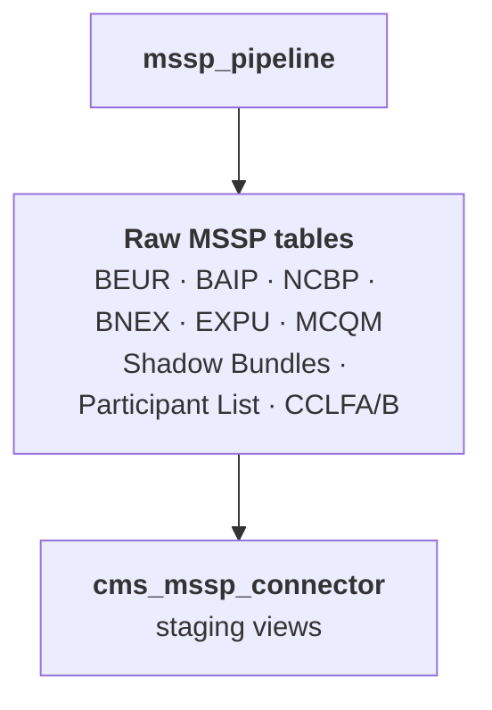

# CMS MSSP Connector

The CMS MSSP Connector is a dbt project for staging the remaining MSSP ACO report files that are not handled by the [CMS ALR Connector](cms-alr-connector) or the [Medicare CCLF Connector](medicare-cclf-connector). In its current form, the repo is focused on source mapping and typed staging views over raw MSSP report tables loaded by the [MSSP Pipeline](mssp-pipeline).

## Source File Coverage

The current project stages the following raw MSSP report tables:

| File Type | Raw Tables | Description |
|---|---|---|
| **BEUR** | `beur_beneficiary_expenditure_utilization_report` | Per-beneficiary expenditure and utilization benchmarks |
| **BAIP** | `baip_beneficiary_advanced_investment_payment` | Advanced investment payment amounts per beneficiary |
| **NCBP** | `ncbp_non_claims_based_payments` | Non-claims-based payment adjustments |
| **BNEX** | `beneficiary_exclusions` | Beneficiaries excluded from benchmark calculations |
| **BNEX MBI XREF** | `excluded_beneficiary_mbi_xref` | MBI cross-reference for excluded beneficiaries |
| **EXPU** | `expu_table_1`, `expu_table_2`, `expu_table_3` | Expenditure and utilization by enrollment type (used in benchmark calculations) |
| **MCQM** | `mcqm_beneficiaries`, `mcqm_dm_001ssp`, `mcqm_bcs_112ssp`, `mcqm_dep_134ssp`, `mcqm_htn_236ssp` | Medicare quality measure results by beneficiary and measure |
| **Participant List** | `participants_list`, `provider_and_supplier_list` | ACO participant TIN and NPI rosters |
| **Shadow Bundles** | `shadow_bundles_dm`, `shadow_bundles_epi`, `shadow_bundles_hh`, `shadow_bundles_hs`, `shadow_bundles_ip`, `shadow_bundles_opl`, `shadow_bundles_pb`, `shadow_bundles_sn` | Episode payment shadow bundle reports by bundle type |
| **CCLFA/B** | `claims_benefit_enhancement_and_demonstration_code_file_cclfa`, `cclfb_claims_benefit_enhancement_and_demonstration_code_file_cclfb` | Claims benefit enhancement and demonstration code files |

## Dependencies

The current repo declares these dbt dependencies in `packages.yml`:

| Dependency | Purpose |
|---|---|
| `dbt_utils` | Shared dbt utility macros |
| `cms_alr_connector` | Local dependency available for downstream integration work |

## Architecture

The latest repo currently contains one implemented model layer:



## Model Layers

### Staging (views)

The repo currently implements 25 staging models. These models are type-casting views over raw MSSP tables with no downstream enrichment layer yet. Major staging groups include:

| Group | Staging models |
|---|---|
| **MSSP reports** | `stg_baip_beneficiary_advanced_investment_payment`, `stg_beur_beneficiary_expenditure_utilization_report`, `stg_ncbp_non_claims_based_payments` |
| **Beneficiary exclusions** | `stg_beneficiary_exclusions`, `stg_excluded_beneficiary_mbi_xref` |
| **EXPU** | `stg_expu_table_1`, `stg_expu_table_2`, `stg_expu_table_3` |
| **MCQM** | `stg_mcqm_beneficiaries`, `stg_mcqm_dm_001ssp`, `stg_mcqm_bcs_112ssp`, `stg_mcqm_dep_134ssp`, `stg_mcqm_htn_236ssp` |
| **Participants** | `stg_participants_list`, `stg_provider_and_supplier_list` |
| **Shadow bundles** | `stg_shadow_bundles_dm`, `stg_shadow_bundles_epi`, `stg_shadow_bundles_hh`, `stg_shadow_bundles_hs`, `stg_shadow_bundles_ip`, `stg_shadow_bundles_opl`, `stg_shadow_bundles_pb`, `stg_shadow_bundles_sn` |
| **CCLF-related MSSP files** | `stg_claims_benefit_enhancement_and_demonstration_code_file_cclfa`, `stg_cclfb_claims_benefit_enhancement_and_demonstration_code_file_cclfb` |

The repo does not currently include the intermediate models and enriched marts described in earlier documentation.

## Configuration

```yaml
vars:
  # Raw MSSP source data loaded by the MSSP Pipeline
  input_database: "your_database"
  input_schema: "your_mssp_schema"

  # Optional connector toggle used by downstream integrations
  cms_alr_connector: true
```

## How to Run

Build the staging project after the MSSP Pipeline has loaded the raw report tables:

```bash
cd cms_mssp_connector
dbt deps
dbt build
```

This produces typed staging views for the supported MSSP report files.
