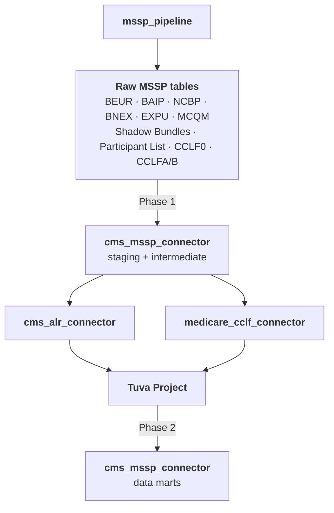

# CMS MSSP Connector

The CMS MSSP Connector is a dbt project that transforms the remaining MSSP ACO report files — those not handled by the [CMS ALR Connector](cms-alr-connector) or the [Medicare CCLF Connector](medicare-cclf-connector) — into source objects and data marts. It runs immediately after the [MSSP Pipeline](mssp-pipeline), as soon as raw files are available in your warehouse. It declares cms_alr_connector, medicare_cclf_connector, and the Tuva Project as dbt dependencies so that its enriched data marts can join MSSP report data against the standardized claims, enrollment, and analytics those projects produce — but those enriched marts are only materialized after the upstream connectors have been built.

## Source File Coverage

The MSSP Pipeline loads many file types into your warehouse. This connector handles everything not already covered by the ALR and CCLF connectors:

| File Type | Raw Tables | Description |
|---|---|---|
| **BEUR** | `beur_beneficiary_expenditure_utilization_report` | Per-beneficiary expenditure and utilization benchmarks |
| **BAIP** | `baip_beneficiary_advanced_investment_payment` | Advanced investment payment amounts per beneficiary |
| **NCBP** | `ncbp_non_claims_based_payments` | Non-claims-based payment adjustments |
| **BNEX** | `beneficiary_exclusions` | Beneficiaries excluded from benchmark calculations |
| **BNEX MBI XREF** | `excluded_beneficiary_mbi_xref` | MBI cross-reference for excluded beneficiaries |
| **EXPU** | `expu_table_1`, `expu_table_2`, `expu_table_3` | Expenditure and utilization by enrollment type (used in benchmark calculations) |
| **MCQM** | `mcqm_beneficiaries`, `mcqm_dm_001ssp`, `mcqm_bcs_112ssp`, `mcqm_dep_134ssp`, `mcqm_htn_236ssp` | Medicare quality measure results by beneficiary and measure |
| **Participant List** | `participants_list`, `provider_and_supplier_list` | ACO participant TIN and NPI rosters |
| **Shadow Bundles** | `shadow_bundles_dm`, `shadow_bundles_epi`, `shadow_bundles_hh`, `shadow_bundles_hs`, `shadow_bundles_ip`, `shadow_bundles_opl`, `shadow_bundles_pb`, `shadow_bundles_sn` | Episode payment shadow bundle reports by bundle type |
| **CCLF0** | `cclf0_summary_stats_header_record` | CCLF file summary statistics |
| **CCLFA/B** | `cclfa_claims_benefit_enhancement`, `cclfb_claims_benefit_enhancement` | Claims benefit enhancement and demonstration codes |

## Dependencies

The CMS MSSP Connector depends on three upstream dbt projects:

| Dependency | Purpose |
|---|---|
| `cms_alr_connector` | Provides the `enrollment` table (assigned beneficiary member months) |
| `medicare_cclf_connector` | Provides `eligibility`, `medical_claim`, and `pharmacy_claim` (Tuva Input Layer) |
| `tuva` | Provides the Core Data Model and data marts for enriching MSSP reports with standardized claims analytics |

These dependencies are declared in `packages.yml` and their output schemas are referenced via dbt sources.

## Architecture

The connector has two phases:

**Phase 1** — Runs immediately after the MSSP Pipeline. Builds staging and intermediate models directly from the raw MSSP tables.

**Phase 2** — Builds enriched data marts after cms_alr_connector, medicare_cclf_connector, and Tuva have been built. These marts join MSSP report data against enrollment, claims, and the Tuva Core Data Model.



## Model Layers

### Staging (views)

One staging model per raw source table. Type-casting only — no business logic. These expose all MSSP report tables as dbt sources with consistent column names and data types.

### Intermediate (tables)

Joins and transformations that link MSSP report data to beneficiary enrollment and claims context from the upstream connectors. For example:
- Joining BEUR/BAIP records to `enrollment` for per-assigned-beneficiary context
- Joining MCQM quality measure results to Tuva's `core.patient` and condition data
- Resolving shadow bundle records against `medical_claim` encounter data

### Data Marts (tables)

Analytical output tables organized by subject area:

| Mart | Description |
|---|---|
| **Benchmark** | BEUR, BAIP, BNEX, and EXPU data joined together for benchmark and savings analysis |
| **Quality Measures** | MCQM results by beneficiary, measure, and performance year, enriched with Tuva claims data |
| **Non-Claims Payments** | NCBP payment adjustments by beneficiary and TIN |
| **Shadow Bundles** | Episode payment shadow bundle results across all bundle types |
| **Participant Roster** | Current and historical ACO participant TIN/NPI list |

## Configuration

```yaml
vars:
  # Raw MSSP source data (loaded by mssp_pipeline)
  input_database: "your_database"
  input_schema: "your_mssp_schema"

  # Upstream connector outputs
  alr_database: "your_database"
  alr_schema: "your_alr_output_schema"

  cclf_database: "your_database"
  cclf_schema: "your_cclf_output_schema"

  tuva_database: "your_database"
  tuva_schema: "your_tuva_output_schema"
```

## How to Run

### Phase 1: Immediately after the MSSP Pipeline

Build the staging and intermediate models as soon as raw files are loaded:

```bash
cd cms_mssp_connector
dbt deps
dbt build --exclude tag:enriched
```

This creates source objects and intermediate models for all MSSP report files without requiring any upstream connectors.

### Phase 2: After cms_alr_connector, medicare_cclf_connector, and Tuva

Once the upstream projects have been built, build the enriched data marts:

```bash
dbt build --select tag:enriched
```

These marts join MSSP report data against enrollment, claims, and Tuva analytics.
