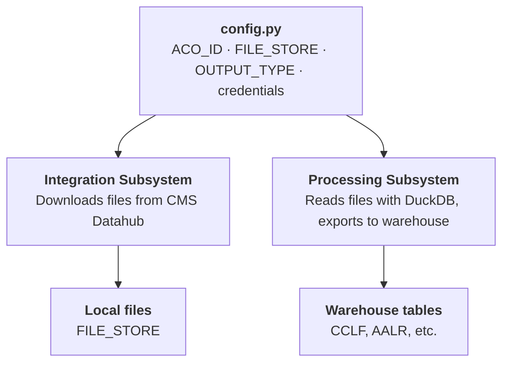

# MSSP Pipeline

The MSSP Pipeline is a Python CLI tool that downloads CMS MSSP ACO files from the CMS Datahub and transforms them into structured tables in your data warehouse. It handles the full extract-load workflow so that downstream dbt projects (the CMS ALR Connector and Medicare CCLF Connector) have the raw data they need.

## Architecture

The pipeline has two subsystems that share a single configuration file:



The integration subsystem wraps the `acoms-cli` binary provided by CMS to authenticate and retrieve file listings. The processing subsystem uses DuckDB to read the raw files and export them to any supported backend — no intermediate Python parsing.

## Installation

To get started with the MSSP Pipeline tool, clone the git repository (PLACEHOLDER) to your local machine or the machine you'll be using to manage runs. Then run the following comands to install the correct dependencies. We leverage `uv` to manage our depencies, you can follow their docs (https://docs.astral.sh/uv/getting-started/installation/) docs for installation steps.

```bash
cd mssp_pipeline

# Base install (if using download tool only):
uv sync

# Install dependencies with processing support and warehouse dependencies for Snowflake, Databricks, Bigquery, and Redshift
uv sync --extra processing --extra snowflake
uv sync --extra processing --extra databricks
uv sync --extra processing --extra bigquery
uv sync --extra processing --extra redshift
# Parquet, Motherduck, and DuckDB only require the processing dependencies
uv sync --extra processing
```

## Configuration

Most day-to-day settings should live in `.env`. `mssp_pipeline/config.py` remains the defaults/loader layer, but normal project setup should happen through environment variables.

### Shared

```dotenv
MSSP_ACO_ID=A1234
MSSP_FILE_STORE=/path/to/downloads
```

| Variable | Description |
|---|---|
| `MSSP_ACO_ID` | Your ACO identifier (e.g. `A1234`) — shared by both subsystems |
| `MSSP_FILE_STORE` | Where organised ACO files live — local path, `s3://bucket/prefix`, `az://container/prefix`, `abfss://...`, or `gs://bucket/prefix` |

### Processing output

```dotenv
MSSP_OUTPUT_TYPE=PARQUET
MSSP_FULL_REFRESH=false
MSSP_OUTPUT_LOCATION=~/.data/output
MSSP_TEMP_LOCATION=./STAGED
```

### AWS (when FILE_STORE is s3://)

```dotenv
AWS_REGION=us-east-1
AWS_PROFILE=my-profile
AWS_ACCESS_KEY_ID=
AWS_SECRET_ACCESS_KEY=
```

### Azure (when FILE_STORE is az:// or abfss://)

```dotenv
# Option A - connection string
AZURE_STORAGE_CONNECTION_STRING='DefaultEndpointsProtocol=https;...'

# Option B - credential chain (managed identity, Azure CLI, env vars)
AZURE_STORAGE_ACCOUNT=mystorageaccount
```

### Download

```dotenv
MSSP_START_YEAR=2025
MSSP_DOWNLOAD_MODE=incremental
MSSP_S3_BUCKET=
```

---

## Output Backends

Select with `MSSP_OUTPUT_TYPE` in `.env`. Each backend requires its own variables.

| `OUTPUT_TYPE` | Destination | Extra to install | Auth |
|---|---|---|---|
| `PARQUET` | Local or cloud filesystem | `--extra processing` | — |
| `DUCKDB` | Local DuckDB file | `--extra processing` | — |
| `MOTHERDUCK` | MotherDuck (cloud DuckDB) | `--extra processing` | MotherDuck token |
| `SNOWFLAKE` | Snowflake table | `--extra snowflake` | RSA key pair |
| `DATABRICKS` | Unity Catalog / Hive table | `--extra databricks` | Personal access token |
| `BIGQUERY` | BigQuery dataset | `--extra bigquery` | Service account JSON |
| `REDSHIFT` | Redshift table | `--extra redshift` | IAM role + S3 staging |
| `FABRIC` | Power BI Fabric lakehouse | `--extra fabric` | Service principal or managed identity |

All backends support incremental mode. The pipeline tracks which source files have already been loaded (by `FILE_PATH`) and only appends rows from new files.

### Example `.env` blocks for every exporter

#### `PARQUET`

```dotenv
MSSP_OUTPUT_TYPE=PARQUET
MSSP_OUTPUT_LOCATION=/path/to/output/parquet
```

#### `DUCKDB`

```dotenv
MSSP_OUTPUT_TYPE=DUCKDB
MSSP_OUTPUT_LOCATION=~/.data/mssp.duckdb
```

#### `MOTHERDUCK`

```dotenv
MSSP_OUTPUT_TYPE=MOTHERDUCK
MOTHERDUCK_DATABASE=mssp_raw
MOTHERDUCK_TOKEN=md_token_here
```

#### `SNOWFLAKE`

```dotenv
MSSP_OUTPUT_TYPE=SNOWFLAKE
MSSP_TEMP_LOCATION=./STAGED
SNOWFLAKE_USERNAME=svc_mssp
SNOWFLAKE_ACCOUNT=acme-org.us-east-1
SNOWFLAKE_DATABASE=MSSP
SNOWFLAKE_SCHEMA=RAW_DATA
SNOWFLAKE_COMPUTE_WAREHOUSE=COMPUTE_WH
SNOWFLAKE_ACCOUNT_ROLE=ACCOUNTADMIN
SNOWFLAKE_RSA_KEY_PATH=~/.ssh/snowflake_rsa_key.p8
SNOWFLAKE_RSA_KEY_PASSPHRASE=
```

#### `DATABRICKS`

```dotenv
MSSP_OUTPUT_TYPE=DATABRICKS
MSSP_TEMP_LOCATION=./STAGED
DATABRICKS_SERVER_HOSTNAME=adb-1234567890123456.7.azuredatabricks.net
DATABRICKS_HTTP_PATH=/sql/1.0/warehouses/abc123def456
DATABRICKS_ACCESS_TOKEN=dapiXXXXXXXXXXXXXXXX
DATABRICKS_CATALOG=main
DATABRICKS_SCHEMA=raw_data
DATABRICKS_STAGING_PATH=dbfs:/tmp/mssp-staging
```

#### `BIGQUERY`

```dotenv
MSSP_OUTPUT_TYPE=BIGQUERY
MSSP_TEMP_LOCATION=./STAGED
BIGQUERY_PROJECT_ID=my-gcp-project
BIGQUERY_DATASET_ID=raw_data
BIGQUERY_STAGING_BUCKET=gs://my-mssp-staging
BIGQUERY_CREDENTIALS_PATH=/path/to/service-account.json
BIGQUERY_LOCATION=US
```

#### `REDSHIFT`

```dotenv
MSSP_OUTPUT_TYPE=REDSHIFT
MSSP_TEMP_LOCATION=./STAGED
REDSHIFT_HOST=example-cluster.abc123.us-east-1.redshift.amazonaws.com
REDSHIFT_PORT=5439
REDSHIFT_DATABASE=dev
REDSHIFT_SCHEMA=raw_data
REDSHIFT_USER=etl_user
REDSHIFT_PASSWORD=super-secret-password
REDSHIFT_IAM_ROLE=arn:aws:iam::123456789012:role/RedshiftCopyRole
REDSHIFT_STAGING_BUCKET=s3://my-mssp-staging
```

#### `FABRIC`

```dotenv
MSSP_OUTPUT_TYPE=FABRIC
MSSP_TEMP_LOCATION=./STAGED
FABRIC_ONELAKE_PATH=abfss://MyWorkspace@onelake.dfs.fabric.microsoft.com/MyLakehouse.Lakehouse/Tables
FABRIC_TENANT_ID=00000000-0000-0000-0000-000000000000
FABRIC_CLIENT_ID=11111111-1111-1111-1111-111111111111
FABRIC_CLIENT_SECRET=client-secret
```

---

## Source File Types

The pipeline processes all MSSP ACO file types available through the Datahub:

| File Type | Description |
|---|---|
| **CCLF** | Medicare Parts A, B, and D claims; beneficiary demographics and MBI cross-reference |
| **MSSP (ALR)** | Assignment List Reports — assigned beneficiary enrollment data |
| **MSSP (BEUR/BAIP)** | Benchmark expenditure and per capita input files |
| **MSSP (NCBP)** | Next-generation CBP payments |
| **MCQM** | Medicare quality measure reports |
| **EXPU** | Expenditure and utilization data |
| **BNEX** | Benchmark expenditure data |
| **BNEX MBI Xref** | MBI cross-reference for benchmark data |
| **Shadow Bundles** | Episode payment shadow bundle reports |
| **Participant List** | ACO participant TIN and NPI roster |

## Output Tables

For each file type, the pipeline creates one or more tables in the target schema. All tables include metadata columns appended by the pipeline:

| Column | Description |
|---|---|
| `FILE_PATH` | Full path of the source file |
| `FILE_NAME` | Source filename |
| `DIRECTORY_NAME` | Directory the file was stored in |
| `FILE_DATE` | Date parsed from the filename |

### CCLF Tables

| Table | Description |
|---|---|
| `parta_claims_header` | Part A claim header records |
| `parta_claims_revenue_center_detail` | Part A revenue center line detail |
| `parta_procedure_code` | Part A procedure codes |
| `parta_diagnosis_code` | Part A diagnosis codes |
| `partb_physicians` | Part B physician/supplier claims |
| `partb_dme` | Part B durable medical equipment claims |
| `partd_claims` | Part D pharmacy claims |
| `beneficiary_demographics` | Beneficiary demographic data |
| `beneficiary_xref` | MBI cross-reference (historical MBIs) |

## Incremental Behavior

The pipeline tracks `FILE_PATH` across all runs. On subsequent executions, only rows from new files are appended — existing data is never overwritten. This makes it safe to run the pipeline repeatedly as new monthly files become available.