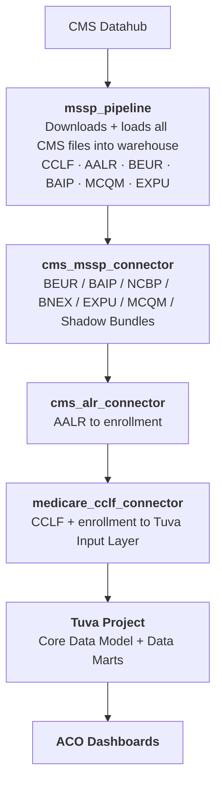
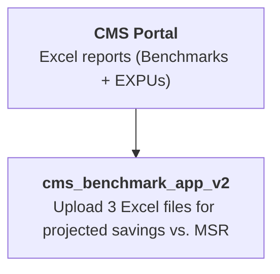

# MSSP ACOs Data Tools Overview

The Medicare Shared Savings Program (MSSP) is a CMS program that allows groups of healthcare providers to form Accountable Care Organizations (ACOs) and share in savings generated by delivering higher-quality, lower-cost care to Medicare beneficiaries.

The Tuva Project provides a suite of tools specifically designed for MSSP ACO organizations to access, transform, and analyze their CMS data. This section documents four components that form an end-to-end claims analytics pipeline, and one standalone tool for calculating benchmark savings calculations.

## Components

### Claims Analytics Pipeline

These components work together sequentially to load raw CMS data into the Tuva Project and produce MSSP-specific analytics:

| Component | Type | Purpose |
|---|---|---|
| [MSSP Pipeline](mssp-pipeline) | Python CLI | Downloads MSSP ACO files from the CMS Datahub and loads them into your data warehouse |
| [CMS MSSP Connector](cms-mssp-connector) | dbt project | Transforms remaining MSSP report files (BEUR, BAIP, NCBP, MCQM, EXPU, Shadow Bundles, etc.) into data marts |
| [CMS ALR Connector](cms-alr-connector) | dbt project | Transforms CMS Assignment List Reports (AALR) into the enrollment format required by the CCLF connector, and creates the attribution input format based on data in the ALRs |
| [Medicare CCLF Connector](medicare-cclf-connector) | dbt project | Transforms CMS Comprehensive Claims and Line Feed (CCLF) files into the Tuva Input Layer and combines with ALR data, then runs the Tuva dbt project to create enriched claims datamarts |
| [CMS ACO Dashboards](cms-aco-dashboards) | Power BI Dashboard | Suite of dashboards that allow a MSSP ACO to understand their attributed population, cost & utilzation, and risk adjustment / quality measure performance |

### Standalone Tools

| Component | Type | Purpose |
|---|---|---|
| [CMS Benchmark App](cms-benchmark-app) | Web app | Calculates projected ACO savings against the CMS Minimum Savings Rate (MSR) using CMS-provided Excel reports |

The CMS Benchmark App operates independently — it takes Excel files downloaded directly from the CMS portal and requires no data warehouse or other pipeline components.

## Claims Analytics Data Flow

The pipeline components run in the following order:

## Benchmark Savings Calculation

The CMS Benchmark App is a separate, standalone tool. It takes three CMS Excel report files (BNMRK, BY3 EXPU, latest QEXPU) uploaded directly through a web interface and calculates projected savings vs. the MSR — no data warehouse required.

## What CMS Data Is Involved

MSSP ACO organizations receive several types of files from CMS through the Datahub portal:

- **CCLF (Comprehensive Claims and Line Feed)** — Medicare Parts A, B, and D claims for assigned beneficiaries, plus beneficiary demographic and MBI cross-reference files. This is the primary claims dataset used for cost and quality analytics.

- **ALR (Assignment List Report)** — Quarterly reports identifying which beneficiaries are assigned to your ACO. Contains enrollment flags, voluntary alignment designations, and underserved beneficiary indicators.

- **Other MSSP Reports and Files** — Additional reports/files including:
     - Beneficiary Advanced Investment Payment Report (BAIP)
     - Aggregate Expenditure/Utilization Report (EXPU)
     - Beneficiary Expenditure/Utilization Report (BEUR)
     - Non-Claims Based Payment (NCBP)
     - quality metrics population (MCQM)
     - Participants List
     - Provider and Supplier List
     - Shadow Bundle reports

## Getting Started

See the [Getting Started](getting-started) guide for step-by-step instructions on setting up and running the full pipeline.
